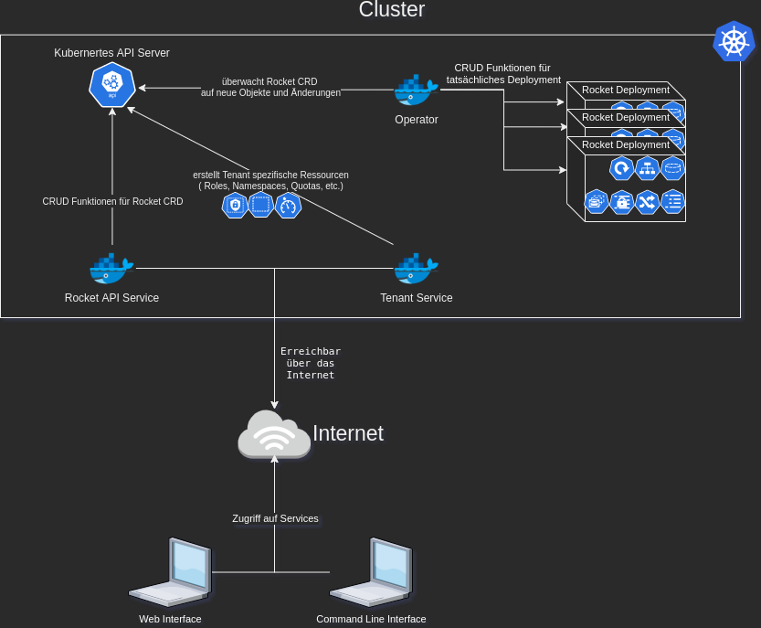
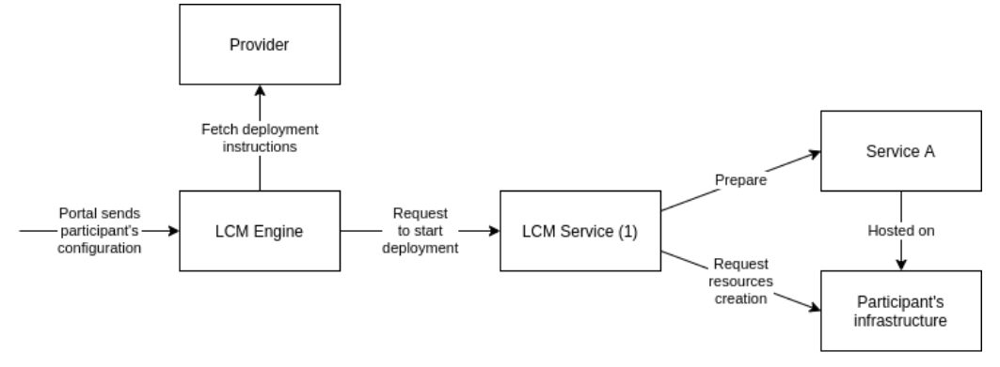

#### Entwicklung eines Chat SaaS mit Kubernetes in Gaia-X kompatibler Cloud

Bachelorarbeit von Lukas Höhl

---

## Inhaltsverzeichnis 

1. Grundlagen
   1. Kubernetes
   2. Gaia-X
   3. Software as a Service (SaaS)
2. Komponenten des Chat SaaS
3. Einbindung in Gaia-X Cloud
4. Datenschutz
5. Fazit & Ausblick

---

## Grundlagen
- SaaS Plattform soll als containerbasierte Lösung betrieben werden
- Kubernetes dient als Orchestrator der Container
- Rocket.Chat als Chat Software


<span style="font-size:0.3em;">Quelle: https://github.com/RocketChat/Rocket.Chat.Artwork/blob/master/Logos/icon-256.png</span>

Note: 
Wieso Rocket? \
-> Selfhosted \
-> Open Source \
-> Hoher Standard an Datenschutz \
    -> Einhaltung von DSGVO Richtlinien


---

### Kubernetes

- Seit 2014 als Open Source Containerorchestrationstool verfügbar
- Entwicklung beginnt bei Google
- Zusammenschluss von "Worker Machines" zu einem Cluster
- Definition von Workloads durch "Objekte"
  - Verschiedene Arten von Objekten wie Pods, Services, Deployment

---

### Gaia-X

- europäische Initiative für einen freien Software Stack
  - Kontrolle über Daten und Workload
  - Governance 
  - Erstellung gemeinsamer Regeln sowie Richtlinien
- Ziel: **Cloudsouveränität**
- anwendbar auf bestehenden Cloudstrukturen

Note:
Governance -> Steuerungsebene einer Organistation
Cloudsouveränität -> Selbstbestimmung

---

#### Prinzipien von Gaia-X
- Föderationen
  - Autonomität innerhalb der Cloud
  - Infrastrukturen auf vertrauensvolle Weise miteinander verbinden
- Dezentralisierung
  - Selbstorgranisation innerhalb der Föderation
- Offenheit
  - Einfaches Hinzufügen, Entfernen sowie Verändern von Komponenten

---

### Software as a Service (SaaS)
- Bereitstellung einer Standardlösung 
- Betrieb durch den Anbieter

Note:
Beispiel: Google Docs

---

## Komponenten des Chat SaaS
- verteilte Architektur
- Microservices, die in Kommunikation mit Kubernetes API stehen

---



---

### Operator
- Erweiterung der Kubernetes API mit eigenem Objekt
  - Objekt dient als API Schnittstelle für andere Systeme
- Erstellung von Objekten für Chat Anwendung im Kubernetes Cluster (Service, Deployment etc.)

---

#### Custom Objekt Spezifikation

```yaml
KIND:     Rocket
VERSION:  chat.accso.de/v1alpha1
RESOURCE: spec <Object>
DESCRIPTION:
     RocketSpec defines the desired state of Rocket
FIELDS:
   adminSpec    <Object>
      email     <string>
      username  <string>
   database     <Object>
      replicas  <integer>
      storageSpec   <Object>
         # embedded Persistent Volume Claim
         ...
         spec   <Object>
            accessModes <[]string>
            dataSource  <Object>
               ...
            dataSourceRef <Object>
               ...
            resources   <Object>
               limits   <map[string]>
               requests <map[string]>
            selector    <Object>
               ...
            storageClassName    <string>
            volumeMode  <string>
            volumeName  <string>
         status <Object>
            ...
      version  <string>
   ingressSpec  <Object>
      annotations       <map[string]string>
    host  <string>
replicas <integer
version <string>
```

---

### Tenant Service
- Konfiguration der einzelnen Kunden im Kubernetes Cluster
  - eigener *Namespace* im Cluster -> Isolation von anderen *Tenants*
  - Zertifikatsherausgeber für SSL Verbindungen

---

### Rocket API Service
- Vereinfachung der Erstellung des Operator Objekts
- OIDC Protokoll für Authentifizierung
  - Keycloak
  - Zuordnen von Tenants im Cluster via OpenID Token

---

## Einbindung in Gaia-X
- Basis der Gaia-X Infrastruktur: **Soveign Cloud Stack**
- Föderationskatalog, in dem Anbieter ihre Services listen können
  - Beschreibung der Services durch *Self Description*
- Lifecycle Managment Engine (LCM Engine)
  - Nutzer des Service gibt gewünschte Konfiguration an
  - Engine kümmert sich um die Erstellung des Services
Note:
- Self-Descriptions werden mittels JSON-LD dargestellt, ein leichtgewichtiges Linked Data Format


---

### Beispiel für Bereitstellung mit LCM Engine



---

### Soveign Cloud Stack
- Freier Software Stack
- Nutzen durch Cloudprovider um Gaia-X konforme Infrastruktur zu erstellen
- Basiert auf OpenStack
- Aktuell noch nicht vollständig implementiert
  - Infrastruktur as a Service

---

## Datenschutz
- Gefährdung von europäischen Datenschutz durch **US Cloud Act**
- Gaia-X Richtlinien zu Datenschutz:
  - strenge Bindung an Kundenvorgaben
  - Klare Definition wie Vorgaben gestellt werden
  - Explizite Angabe bei Datenweitergabe an Dritte
  - Angabe von Unterauftragsverarbeitern von Daten
- Artikel 26 und 28 der Datenschutz Grundverordnung müssen eingehalten werden!
<!-- TODO: Recherchieren von den Artikeln und als Note hinzugeben -->

Note:
- US Cloud Act:
  - amerikanische Cloud provider sind verpflichtet, jeglichen Datenverkehr eines Kunden zu speichern
  - US Behädern müssen Zugriff auf diese Daten bekommen können -> grundlegendes Problem zur Integrität und Vertraulichkeit der Datenverarbeitung bei Cloud Computing
- Artikel 26:
  - Personenbezogene Daten dürfen für Zwecke des Beschäftigungsverhältnisses verarbeitet werden
  - Einwilligung muss Freiwillig geschehen
- Artikel 28: Auftragsdatenverarbeitung
  - Verarbeitung von Daten mit einem Auftragsverarbeiter muss auf Grundlage eines Vertrags geschehen
  - Erfolgt eine Verarbeitung im Auftrag eines Verantwortlichen, so arbeitet dieser nur mit Auftragsverarbeitern, die hinreichend Garantien dafür bieten, dass geeignete technische und organisatorische Maßnahmen so durchgeführt werden, dass die Verarbeitung im Einklang mit den Anforderungen dieser Verordnung erfolgt und den Schutz der Rechte der betroffenen Person gewährleistet.


---

## Fazit
- SaaS Implementierung für Gaia-X Cloud schon möglich
- Gaia-X Standard sowie SCS fehlt es an Reife und Services
  - aktuell nur Infrastuktur Services
  - viele Stimmen bemängeln das große Maß an Bürokratie
- Kubernetes als attraktive Plattform für SaaS Anwendungen

---

## Ausblick
- Gaia-X steht aktuell noch in den Startlöchern
  - Vollständige Implementation von allen Services soll 2023 fertiggestellt sein
- Globale Konkurrenz für Hyperscaler Clouds wie **AWS**, **GCP** oder **Azure** frühstens 2025


---

**Danke für ihre Aufmerksamkeit!**

Noch Fragen?